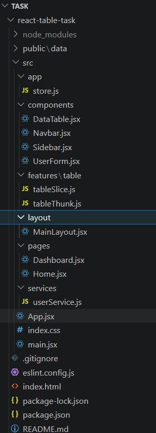
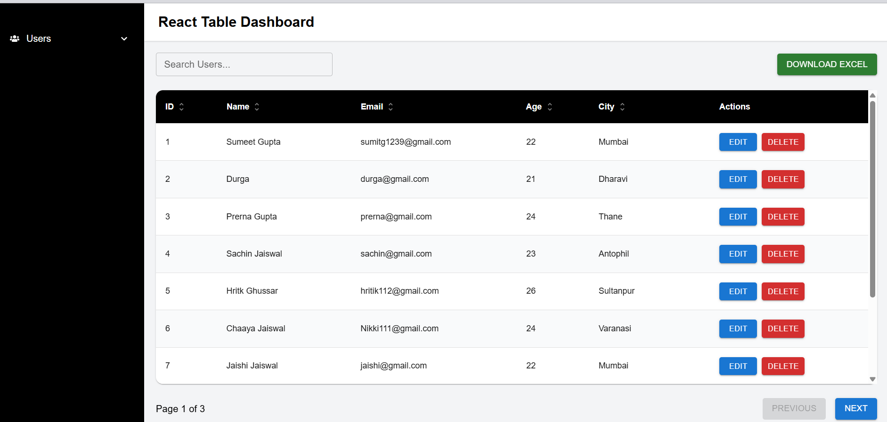
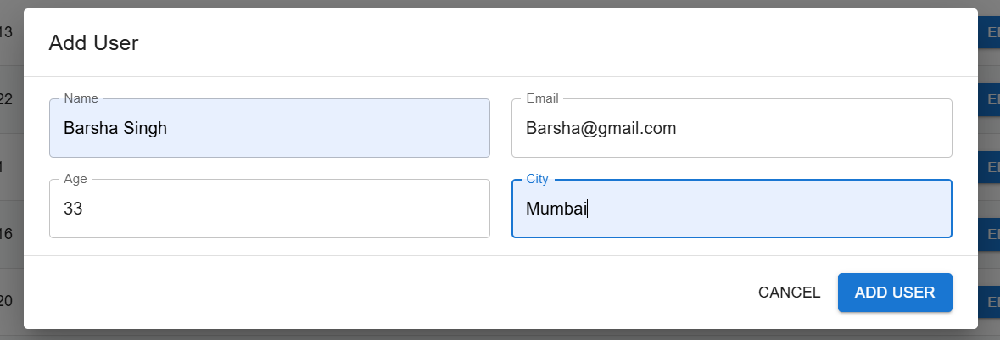
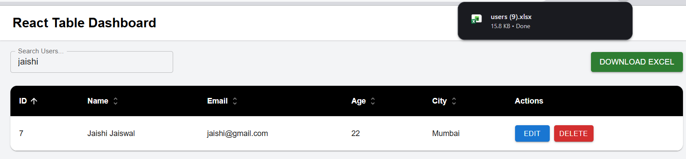
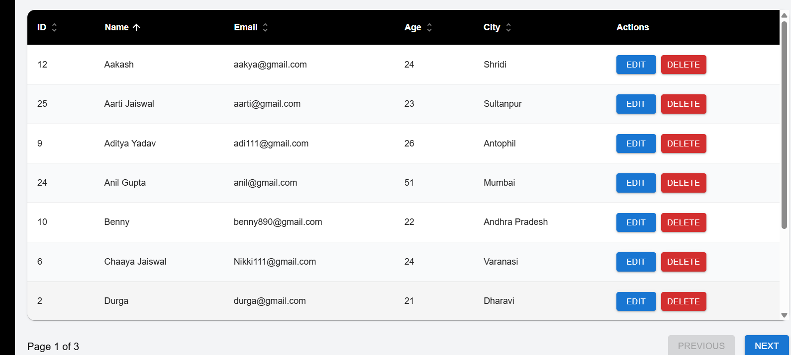
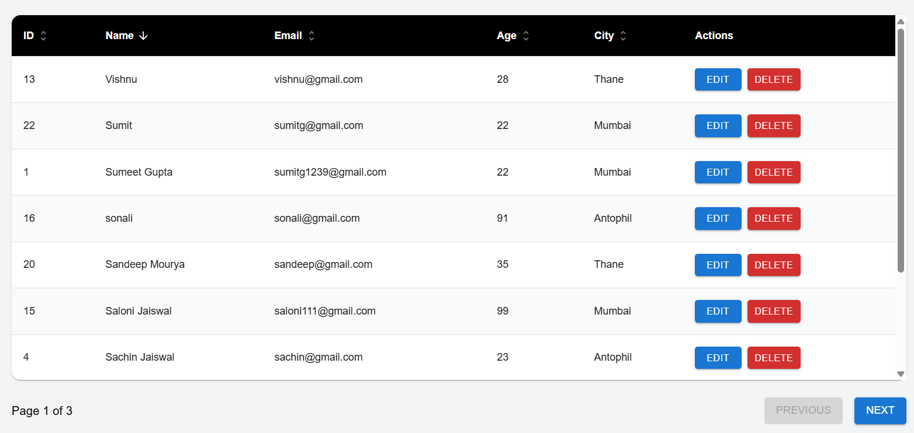
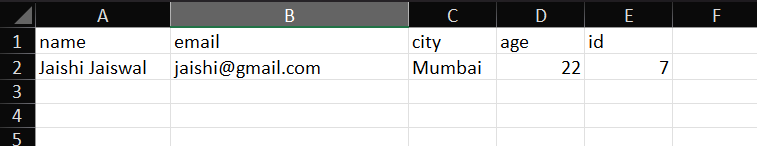

# User Management CRUD App

A modern User Management CRUD application built using React.js, Redux Toolkit, Material UI, React Hook Form, and JSON Server.


# Features

* Add User
* Edit User
* Delete User
* Search Users
* Sorting
* Pagination
* Excel Download
* Form Validation
* Duplicate Email Validation
* Responsive UI
* Redux Toolkit State Management
* React Hook Form Integration

---

# Tech Stack

* React.js
* Redux Toolkit
* React Hook Form
* Material UI
* Tailwind CSS
* TanStack React Table
* React Toastify
* JSON Server

---

# Installation

Clone the repository:

```bash
git clone https://github.com/SUMEET1239/Task.git
```

Go to project directory:

```bash
cd Task
```

# Dependencies Used

## Main Dependencies

```bash
npm install react-redux @reduxjs/toolkit
npm install @tanstack/react-table
npm install react-hook-form
npm install react-toastify
npm install xlsx
npm install @mui/material @emotion/react @emotion/styled
npm install @mui/icons-material
npm install react-icons
npm install tailwindcss

---

# Run Frontend

```bash
npm run dev


---

# Run JSON Server

```bash
npm run json-server


---

# Project Structure

```bash
src/
|
|__App/
|   |__store.js
│
├── components/
│   ├── DataTable.jsx
│   ├── Sidebar.jsx
│   └── UserForm.jsx
│   |__Navbar.jsx
|
├── features/
│   └── table/
│       ├── tableSlice.js
│       └── tableThunk.js
│
|__layout
|     |___MainLayout.jsx
|
|___pages
|     |___Home.jsx
|     |___DashBoard.jsx
|
├── services/
│   └── userService.js
│
├── store/
│   └── store.js
│
└── App.jsx
```

---

# Validation Rules

## Name

* Required
* Only alphabets allowed
* Minimum 3 characters
* Maximum 30 characters

## Email

* Required
* Valid email format
* Duplicate emails not allowed

## Age

* Required
* Minimum age should be 17
* Maximum age should be 99

## City

* Required
* Only alphabets allowed

---

# Functionalities

## User Table

* Search Users
* Sorting
* Pagination
* Sticky Header
* Excel Export

## User Form

* Add User
* Edit User
* Form Validation
* Reset Form

---

# Screenshots

## Project Files



---

## Dashboard

Dashboard UI



---

## Add User Modal



---

## Table Sorting and Search


---

## Search Key Download



---

## Ascending Order



---

## Descending Order



---

## Excel Document Download




# Author

Sumeet Gupta
